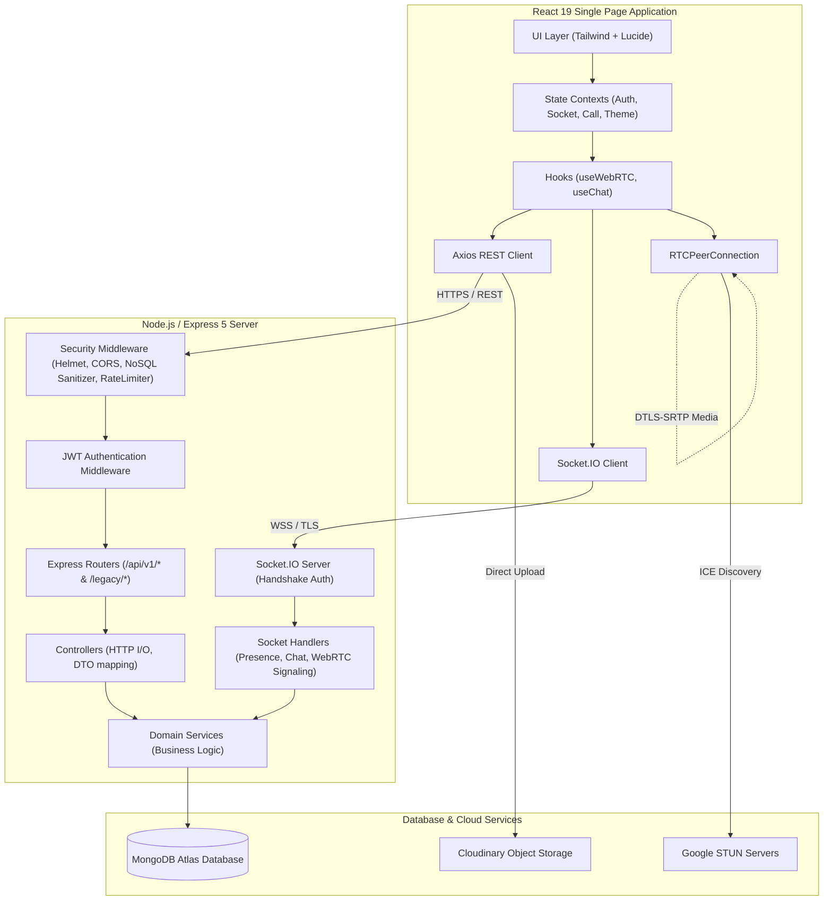

# System Architecture: NOVA Social Platform

NOVA follows Clean Layered Architecture with strict separation of concerns across HTTP controllers, business logic services, data models, real-time socket handlers, and peer-to-peer WebRTC media transports.

---

## 1. High-Level System Architecture

---

## 2. Backend Layer Responsibilities

### 1. Middleware Layer (`src/middleware/`)
* **`security.js`**: Enforces strict Helmet headers, dynamic origin verification for CORS, and recursively strips NoSQL injection operators (`$`, `.`).
* **`rateLimiter.js`**: Uses `express-rate-limit` to prevent brute force attacks on authentication endpoints (20 attempts / 15 min) and general API throttling (300 requests / 15 min).
* **`auth.js`**: Request-scoped JWT validation extracting Bearer tokens from headers or secure cookies. Protects against cross-request memory leaks.
* **`errorHandler.js`**: Centralized operational error interceptor converting Mongoose CastErrors, duplicate key violations, and JWT errors into clean, structured JSON without exposing internal stack traces.

### 2. Controller Layer (`src/controllers/`)
* Parses HTTP requests (`req.body`, `req.params`, `req.query`, `req.user`).
* Passes clean parameters to the corresponding service method.
* Formats HTTP status codes (`200 OK`, `201 Created`, `400 Bad Request`, `403 Forbidden`, `404 Not Found`).

### 3. Service Layer (`src/services/`)
* Contains **all business logic**, multi-model transactions, and authorization checks.
* Completely decoupled from the HTTP transport layer, allowing reuse in both REST routes and WebSocket handlers.
* Enforces atomic operations via MongoDB (`$addToSet`, `$pull`, `$inc`).

### 4. Real-Time Socket Layer (`src/sockets/`)
* **Handshake Authentication**: Verifies JWT token before establishing socket connections.
* **Room Segregation**:
  * `user:{userId}`: User-specific private notification and call signaling room.
  * `conversation:{conversationId}`: Shared chat room protected by membership authorization.
  * `call:{callId}`: Temporary call signaling room.
* **No Spoofing**: Sockets strictly overwrite client-supplied sender IDs with the authenticated `socket.user._id`.

---

## 3. Frontend Architecture

* **Framework**: React 19 with Vite 6.
* **Styling**: Tailwind CSS v4 with custom dark/light theme CSS variables.
* **State Management**: React Context (`AuthContext`, `SocketContext`, `CallContext`, `ThemeContext`).
* **Workstation Layout**:
  * **NavRail**: Compact sidebar containing brand, core navigation routes, quick composer trigger, theme switch, and logout.
  * **Primary Content Stream**: Central timeline for mixed-media posts, threaded replies, and reactions.
  * **Context Intel Panel**: Right-hand panel displaying online peers and fast-call buttons.
