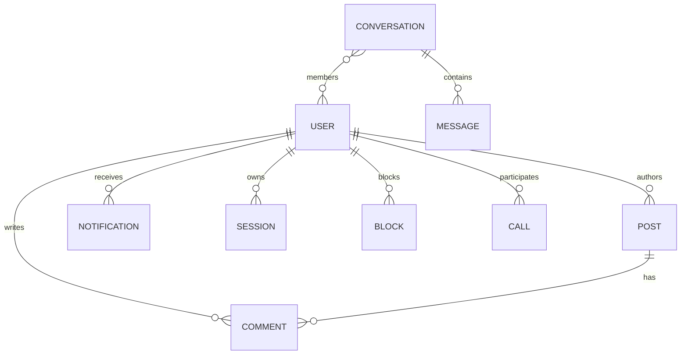

# Database Design & Schemas: NOVA

Database: MongoDB with Mongoose 9 ODM.

---

## 1. Entity-Relationship Overview

---

## 2. Core Collections & Indexes

### `users`
* `userId` (String, unique, index) — virtual alias: `username`
* `emailId` (String, index) — virtual alias: `email`
* `fullname` (String)
* `password` (String, select: false)
* `otp` (Number, select: false)
* `profilePic` ({ url, public_id })
* `coverPic` ({ url, public_id })
* `follower` ([ObjectId, ref: 'User'])
* `following` ([ObjectId, ref: 'User'])
* `savedPost` ([ObjectId, ref: 'Post'])
* `privacy` ({ isPrivate: Boolean, allowDirectMessages: String })
* `appearance` (String: 'dark' | 'light')
* `timestamps`: true

### `posts`
* `postedBy` (ObjectId, ref: 'User', index)
* `caption` (String)
* `description` (String)
* `postUrl` (String, legacy compatibility)
* `public_id` (String)
* `media` ([{ url, public_id, mediaType }])
* `likes` ([ObjectId, ref: 'User'])
* `reactions` ([{ user: ObjectId, type: String }])
* `hashtags` ([String], index)
* `commentsCount` (Number)
* `timestamps`: true (index on `createdAt: -1`)

### `comments`
* `postId` (ObjectId, ref: 'Post', index)
* `commentedBy` (ObjectId, ref: 'User', index)
* `text` (String)
* `parentCommentId` (ObjectId, ref: 'Comment', default: null)
* `timestamps`: true

### `conversations`
* `members` ([ObjectId, ref: 'User'], index)
* `isGroup` (Boolean)
* `lastMessage` (ObjectId, ref: 'Message')
* `lastMessageAt` (Date, index: -1)
* `timestamps`: true

### `messages`
* `conversationId` (ObjectId, ref: 'Conversation', index)
* `sender` (ObjectId, ref: 'User', index)
* `text` (String)
* `mediaUrl` (String)
* `mediaType` (String)
* `status` (String: 'SENT' | 'DELIVERED' | 'READ')
* `readBy` ([{ user: ObjectId, readAt: Date }])
* `timestamps`: true

### `calls`
* `caller` (ObjectId, ref: 'User', index)
* `callee` (ObjectId, ref: 'User', index)
* `callType` (String: 'audio' | 'video')
* `status` (String: 'ringing' | 'accepted' | 'rejected' | 'missed' | 'cancelled' | 'completed')
* `startedAt`, `endedAt`, `duration`
* `timestamps`: true

### `blocks`
* `blocker` (ObjectId, ref: 'User', index)
* `blocked` (ObjectId, ref: 'User', index)
* Compound unique index on `{ blocker: 1, blocked: 1 }`
