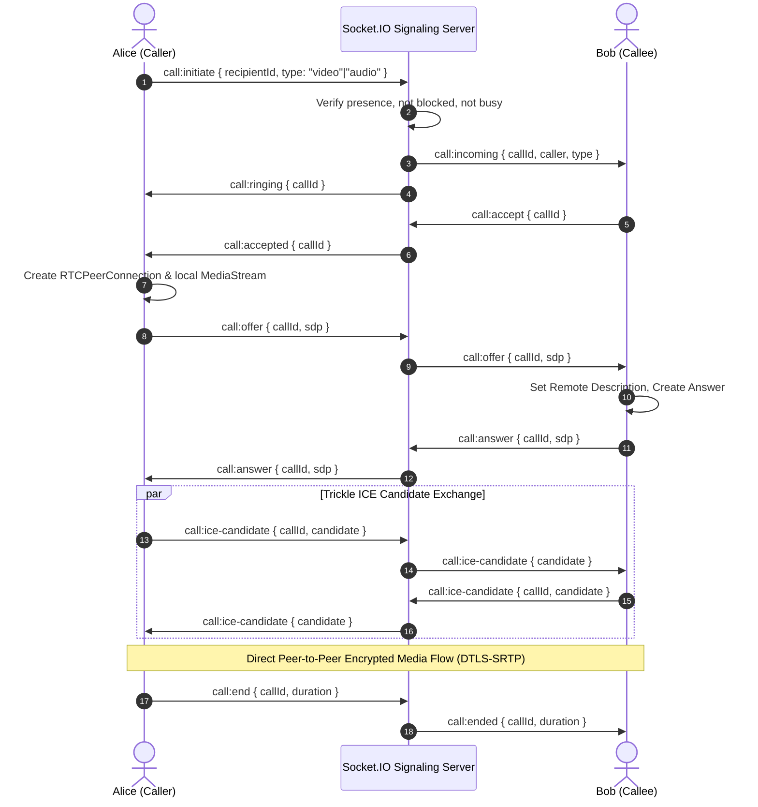

# WebRTC Calling Architecture & Cryptographic Disclosure: NOVA

---

## 1. Signaling & Media Pipeline



---

## 2. Cryptographic Transparency & Threat Model

* **Media Encryption**:
  * Audio and video streams flow directly between peer browsers via standard **DTLS-SRTP** (Datagram Transport Layer Security / Secure Real-Time Transport Protocol).
  * Encryption keys are negotiated directly between peer endpoints during the DTLS handshake.
  * The application server **never** intercepts, decrypts, or records raw audio/video frames.
* **Signaling Encryption**:
  * SDP offers, answers, and ICE candidate exchanges are transported over TLS (`wss://` / `https://`) authenticated by JWT.
* **Honest Disclosure**:
  * NOVA uses standard WebRTC DTLS-SRTP for peer media encryption.
  * We do **not** claim proprietary or custom cryptographic algorithms.
  * Signaling metadata passes through the server to coordinate session negotiation.

---

## 3. NAT Traversal: STUN and TURN

WebRTC requires STUN/TURN servers to establish peer connections across NATs and firewalls:
* **STUN (Session Traversal Utilities for NAT)**:
  * Default configured servers: `stun:stun.l.google.com:19302` and `stun:stun1.l.google.com:19302`.
  * Resolves public IP address and port mapping for direct peer connectivity.
* **TURN (Traversal Using Relays around NAT)**:
  * For restrictive corporate or symmetric NAT firewalls where direct P2P connections fail, TURN relays encrypted packets.
  * Configuration in `.env`:
    ```env
    TURN_SERVER=turn:your-turn-server.com:3478
    TURN_USERNAME=your_turn_user
    TURN_PASSWORD=your_turn_password
    ```

---

## 4. Scalability: Group Calling & SFU Architecture Blueprint

For Phase 1 MVP, 1-to-1 audio and video calling is implemented. For scaling to multi-party group calls (Phase 3):
* A **Selective Forwarding Unit (SFU)** such as LiveKit, Janus, or mediasoup is recommended instead of a full-mesh topology.
* Full-mesh requires $N \times (N-1)$ connections, which overwhelms client bandwidth beyond 3 participants.
* An SFU receives one stream per participant and forwards it to all other participants, dramatically reducing client CPU and uplink bandwidth.
